## FabienDostieIT Hello there, 👋 I'm Fabien Dostie and I do IT 💻

Welcome to our organization GitHub page! Here you'll find our combined stats from personal and organization repositories.

## 🚀 Current Projects
### ✅ CSValidator
https://github.com/FabienDostieIT/CSV_Data_Validator

A modern web-based tool to validate CSV data against JSON schemas, edit CSVs, and ensure compliance with custom or predefined structures. Built with Next.js 15+, TypeScript, and a robust UI/UX. Along with a strong CI/CD pipeline featuring GitHub workflows & hooks, unit + integration tests & e2e tests

### 📊 partner schemas tools
https://github.com/la-vitrine/partner-schemas-tools

Single source of truth for La Vitrine's data schemas and validation rules. Contains JSON Schema (Draft-07) definitions that standardize cultural event data formats for partner integrations, API validation, and documentation generation. Used across our platform to ensure consistent data quality and streamline the partner onboarding process. And a robust CI/CD pipeline featuring GitHub workflows & hooks and extensive test suite

### 🚧 Voi (WIP) 🎙️
[link coming soon]

Voi is a privacy-first, voice centric, but text also, personal note taking and knowledge management application built with Flutter. It excels at capturing voice notes, transcribing them accurately, and intelligently organizing information.
Key Innovations:
Contextual Relationship Engine: Sophisticated on-device NLP and SLMs map multi-dimensional relationships across temporal, spatial, social, content, and action contexts from diverse data sources (local device, cloud, self-hosted).
Privacy-First Architecture: Prioritizes on-device processing, end-to-end encryption, and granular user control for secure knowledge management.
Universal Data Integration: Seamlessly connects and queries information from calendar events, location history, contacts, photos, documents, messages, app usage, and more.
Natural Language Interaction: Enables complex conversational queries to retrieve interconnected knowledge effortlessly.

## 📊 GitHub Metrics Dashboard

  <!-- GitHub Metrics SVG will be here -->
  

  <!-- Placeholder for potential future content or removed sections -->

## Experience and Tools

I have some experience with:

  <!-- Web -->
  
  
  
  
  
  
  
  
  
  
  <!-- Backend -->
  
  
  
  
  
  
  <!-- Infra/Scripting -->
   
  
  
  
  <!-- Data/Markup -->
  
  
  
  <!-- Mobile/Other -->
  
  

Some of the tools I use frequently:

  <!-- OS -->
  
  
  
  
  <!-- Dev Env -->
  
  
  
  
  
  
  <!-- Virtualization/Container -->
  
  
  
  <!-- Cloud/Hosting -->
  
  
  
  
  
  <!-- CI/CD -->
  
  
  <!-- Monitoring -->
  
  
  <!-- Databases -->
  
  <!-- Project Management -->
  
  
  
  <!-- Design/Video/Audio -->
  
  
  
  
  
  
  <!-- Hardware -->
  
  
  <!-- Testing/Linting -->
  
  
  <!-- Network/Infra -->
  
  
  <!-- AI -->
  
  

## 👥 Our Team
[Optional: Brief info about key team members]

## 📫 Connect With Us
[Contact information and social links]

Last updated: 2025-10-31
